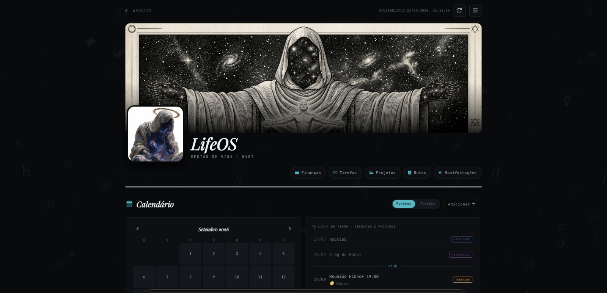
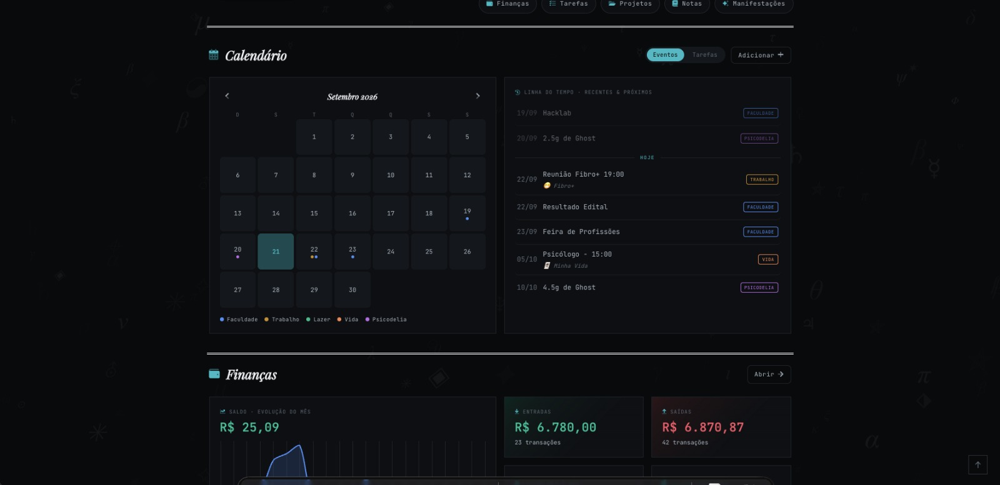
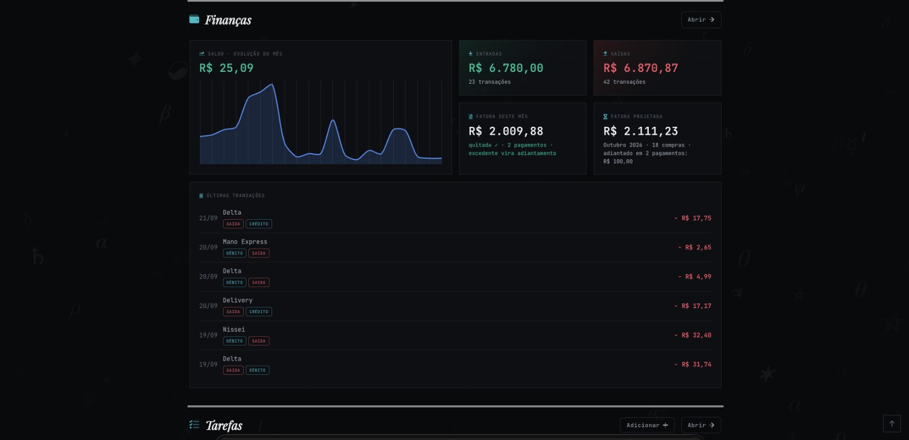
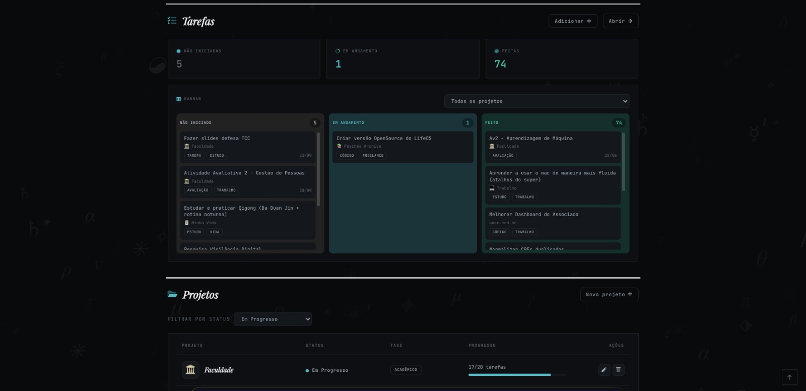
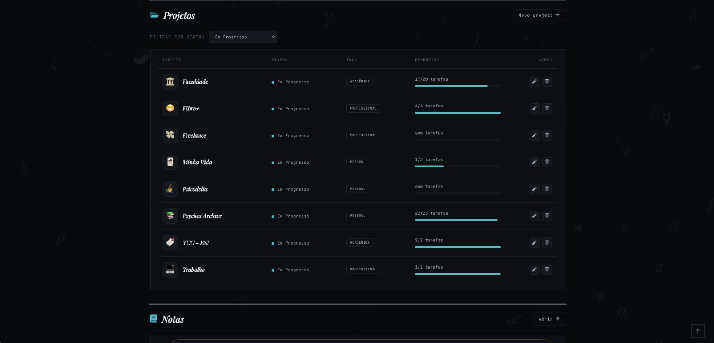
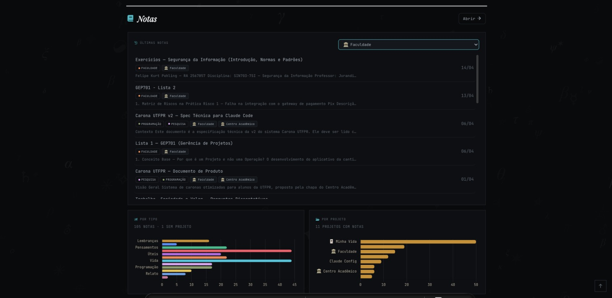
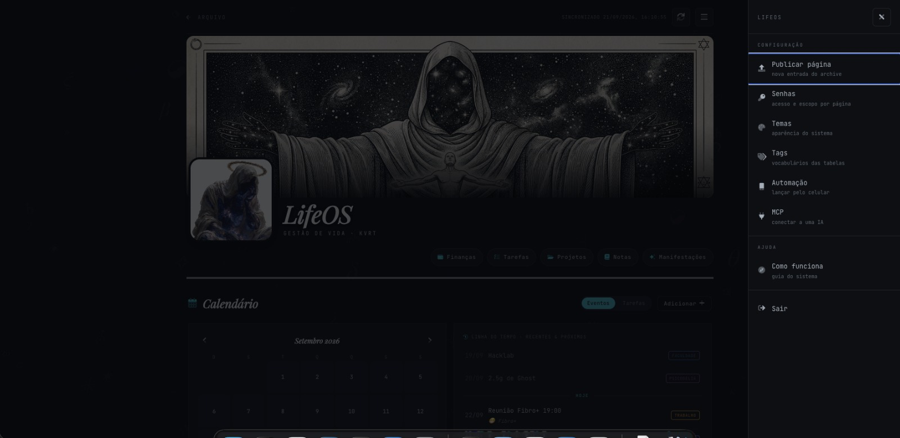
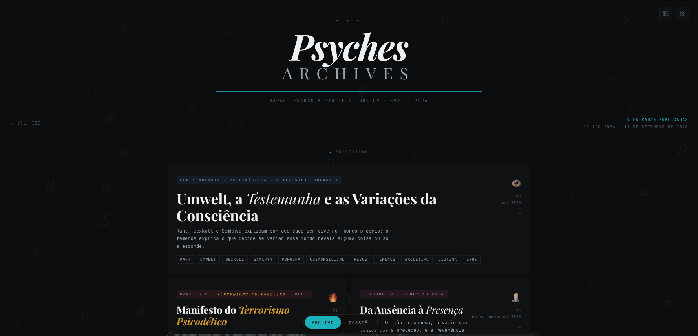

# LifeOS

Um sistema de gestão de vida que você hospeda, com um blog estático opcional
ao lado. Sem assinatura, sem servidor para alugar, sem framework.

**Custo real: zero.** GitHub Pages para o site, plano free do Supabase para os
dados. O uso de uma pessoa fica muito abaixo dos limites dos dois.

**Repositório:** https://github.com/Kzrtt/lifeos ·
**Instância no ar:** [Psychḗs Archives](https://kzrtt.github.io/psyches-archive/index.html?vol=3)

---

## Como ele é



O **hub** abre no que importa hoje: calendário à esquerda, linha do tempo dos
próximos eventos à direita, e abaixo o resumo de cada módulo. O banner e o
avatar são seus — trocam em um arquivo de configuração.



Cada tipo de evento tem cor própria, definida por você na tela de Tags. O
calendário alterna entre **eventos** e **tarefas** no mesmo lugar.



Finanças trata **crédito como o que ele é**: uma compra no cartão não sai do
caixa hoje, vira fatura futura. O card de fatura projetada mostra o que fecha
nos próximos meses, e o sistema entende pagamento antecipado.



Tarefas em kanban, arrastáveis entre colunas. Toda tarefa pertence a um
projeto — é o que impede a lista de virar uma caixa de entrada infinita.



Projetos são o eixo do sistema: tarefas exigem um, notas podem ter vários,
eventos podem ter um. A barra de progresso vem das tarefas concluídas.



Notas em markdown, com os gráficos mostrando onde o seu material se acumula.
É daqui que sai a matéria-prima do arquivo público.



Tudo se configura de dentro do próprio sistema: senhas, temas, vocabulários,
o token do GitHub, a automação do celular e o conector de IA. Nada exige SQL
no painel do Supabase.



E a metade pública: um arquivo paginado por volumes, com modo claro e escuro,
publicado pelo próprio painel. Se você não quiser essa metade,
`blog: { habilitado: false }` desliga.

> As capturas são de uma instância real — a
> [Psychḗs Archives](https://kzrtt.github.io/psyches-archive/index.html?vol=3),
> do autor do projeto. Os dados, nomes de projeto e paleta são dela; uma
> instalação nova começa vazia, com o tema sépia.

---

## O que ele faz

Seis áreas, todas atrás de uma senha:

| Módulo | O que guarda |
|---|---|
| **Hub** | A visão do dia: calendário, tarefas, saldo, notas recentes |
| **Finanças** | Entradas e saídas, projeção de fatura de crédito, comparação entre meses |
| **Tarefas e Projetos** | Kanban e lista. Toda tarefa pertence a um projeto |
| **Notas** | Markdown, vinculado a um ou mais projetos |
| **Eventos** | Calendário, dentro do próprio hub |
| **Manifestações** | Objetivos de longo prazo |

E três coisas que a maioria dos sistemas parecidos não tem:

- **Conector MCP** — sua IA lê o sistema inteiro por conta própria. Você
  pergunta "o que eu já escrevi sobre isso?" e ela busca nas suas notas.
- **Webhook para o celular** — lançar um gasto sem abrir o navegador. Há um
  atalho de iPhone pronto; qualquer outra plataforma serve mandando o mesmo
  JSON.
- **Blog estático** — páginas HTML independentes, publicadas pelo próprio
  painel, mais uma **galeria** de imagens. Opcional:
  `blog: { habilitado: false }` desliga essa metade.

---

## Instalação

Leia **[`SETUP.md`](SETUP.md)**. Dois caminhos: assistido por IA (tem um
prompt pronto para colar) ou manual.

Resumo do manual: forkar, criar um projeto Supabase, rodar dois arquivos SQL,
subir as Edge Functions, e editar **um** arquivo
(`assets/js/lifeos-config.js`).

Depois de instalado, o comando `/personalizar` (Claude Code) entrevista você e
aplica nome, tema, e remove o que sobrou do repositório de origem.

> **Troque a senha mestre antes de publicar.** A instalação nasce com a senha
> `lifeos`, que existe só para você conseguir entrar na primeira vez.

---

## Como é construído

Sem build step. Sem framework. Sem `node_modules`. `git push` publica.

```
index.html              capa do blog (renderiza a partir de assets/js/manifest.js)
galeria.html            galeria de imagens (upload atrás de senha)
pages/                  as entradas do blog, uma por arquivo HTML
lifeos/                 o painel — 11 páginas, cada uma isolada da outra
assets/js/              o JS de cada página + a config da instância
assets/css/themes/      9 temas, em versão clara (blog) e escura (painel)
supabase/migrations/    o schema completo
supabase/functions/     as Edge Functions
docs/                   referência de arquitetura
```

Duas decisões que explicam o resto do código:

**Cada página é autossuficiente.** As páginas do painel não importam funções
umas das outras; padrões repetidos são copiados, não compartilhados. O preço é
repetição; o retorno é que mexer numa página nunca quebra outra. Ver
[`docs/LIFEOS.md`](docs/LIFEOS.md) §2.

**As entradas do blog são HTML cru, com o CSS dentro.** Num gerador de site,
toda página cabe no molde do tema. Aqui, uma entrada que precisa de um
diagrama próprio, uma linha do tempo horizontal ou um fundo diferente
simplesmente tem. E uma IA consegue escrever a página inteira, porque é só
HTML.

---

## Segurança, em uma parada

O dado fica no seu Supabase, com RLS ligado e **nenhuma** policy: só a
`service_role` alcança as tabelas, e ela vive apenas dentro das Edge
Functions. A chave pública que vai no site não abre nada sozinha.

A autenticação é uma senha mestre validada server-side. Não é multiusuário,
não tem OAuth, não tem recuperação de senha — é um sistema pessoal, e o
desenho assume isso.

Duas coisas para saber antes de confiar dados sensíveis a ele, ambas
documentadas em [`docs/AUTH.md`](docs/AUTH.md): as senhas ficam em texto puro
no banco, e a tela de publicação recebe um token do GitHub no navegador.

---

## Ícones

Este repositório usa **Font Awesome 5 Free**. O projeto de origem usava o kit
Pro (duotone), que é licenciado e não pode ser redistribuído — a camada em
`assets/css/icons.css` mapeia as mesmas classes para os glifos livres.

Tem licença Pro? Troque o `<link>` nas páginas pelo CSS do seu kit e copie os
webfonts; o duotone volta sem nenhuma outra mudança.

---

## Estado

Funcionando e em uso. O que falta está em
[`docs/OPENSOURCE.md`](docs/OPENSOURCE.md), com honestidade sobre o que ainda
é atrito.

## Licença

MIT. Ver [`LICENSE`](LICENSE).
